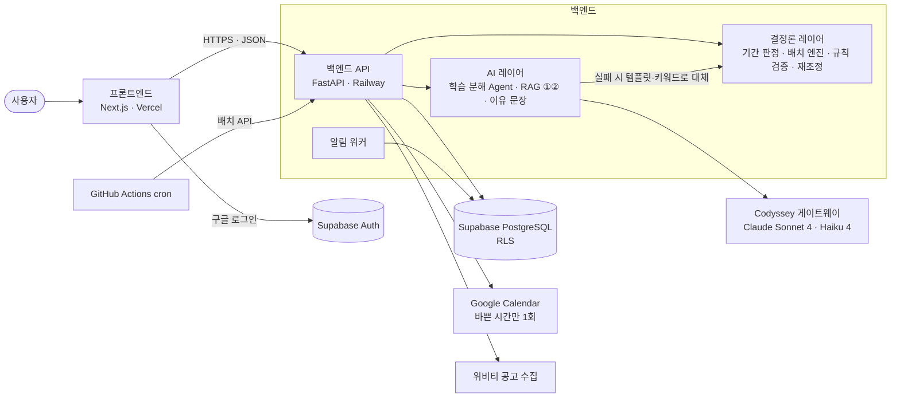

# 스터디페이스 (StudyPace)

> 학습 목표 기반 맞춤 일정 플래너 — Codyssey 최종 프로젝트

**"이 자격증, 지금 시작하면 기한 안에 끝낼 수 있나?"** 에 숫자로 답하고,
그 답을 **오늘 저녁 7시에 무엇을 공부할지**까지 자동으로 쪼개 주는 AI 학습 일정 플래너.
목표만 갖고 와도 계획을 만들고, 밀리면 매일 밤 대신 다시 짠다.

| 항목 | 내용 |
|---|---|
| 개발 기간 | 2026-09-14 ~ 2026-10-18 (5주) · 발표 10-19~20 |
| 팀 구성 | 5인 · 전원 비전공자 · AI 도구를 활용해 개발 |
| 핵심 AI 기술 요소 | **AI Agent · RAG · 자동화 워크플로우 · Long-term Memory** (4개) |
| 기능 규모 | 총 69개 — Must 38 / Should 25 / Could 3 / Won't 3 · 비기능 요구사항 12개 |
| 현재 단계 | 3주차 (10-02) · **기능 구현과 내부 점검 완료** (백엔드 테스트 약 500개 · 테스트 계정 실사용 점검 9차) · **배포와 실사용자 테스트(10-08~12) 준비 중** ([개발 기록](#개발-기록)) |

---

## 해결하려는 문제

자격증·공모전 준비는 "무엇을 할지"보다 **"언제 무엇을 얼마나 할지"** 에서 무너진다.
기존 도구는 사용자가 이미 계획을 갖고 있다고 전제하지만, 정작 어려운 것은 **목표를 오늘 할 일로 바꾸는 변환**이다.

| 문제 | 해결 기능 |
|---|---|
| P1 목표가 없거나 막연하다 | `FR-GOAL-01` `FR-GOAL-03` `FR-GOAL-05` `FR-GOAL-11` |
| P2 기한 안에 되는지 모른다 | `FR-GOAL-04` `FR-GOAL-09` `FR-GOAL-10` `FR-CONT-10` |
| P3 계획을 실행 단위로 못 쪼갠다 | `FR-PLAN-02` `FR-PLAN-03` `FR-MAIN-03` |
| P4 한 번 밀리면 계획 전체가 무너진다 | `FR-PLAN-06` `FR-PLAN-07` `FR-PACE-02` `FR-PACE-03` |
| P5 지금 잘 가고 있는지 모른다 | `FR-PACE-01` `FR-PACE-04` `FR-CONT-04` `FR-UI-01` |

---

## 4개 파이프라인

| # | 파이프라인 | 실행 시점 | 핵심 기술 |
|---|---|---|---|
| 0 | 목표 탐색 | 목표 없는 신규 사용자만 · 1회 | RAG + 결정론적 계산 |
| 1 | 일정 생성 | 목표 확정 시 1회 + 매일 03:00 재조정 | AI Agent + 규칙 엔진 |
| 2 | 공모전 추천 | 수집 매일 05:00 · 추천 주 1회 | RAG + 자동화 |
| 3 | UI 적응 | 학습 이벤트 발생 시 실시간 | 자동화 + Memory |

### 핵심 설계 원칙 — LLM을 쓰는 곳과 쓰지 않는 곳을 가른다

| 구간 | 방식 | 이유 |
|---|---|---|
| 판정 · 계산<br>(기간 적합성, 스케줄 배치, 진도 기준선) | **LLM 미사용 · 결정론적** | 같은 입력에 항상 같은 결과가 나와야 검증이 가능하다. 규칙 위반(마감 초과·선후 위반) 0건을 보장할 수 있어야 한다 |
| 분해 · 언어화<br>(학습 분해, 추천 이유) | **LLM 사용** | 규칙으로 열거할 수 없는 영역 |

덕분에 **LLM이 실패해도 일정은 항상 만들어진다.** 분해가 실패하면 표준 커리큘럼 템플릿으로 대체하고 배치 로직은 그대로 동작한다.

---

## 시스템 아키텍처



구성 요소, 4개 파이프라인의 처리 흐름, 데이터 모델, 인증·보안, 자동화, 배포 구성은
**[docs/architecture.md](docs/architecture.md)** 에 그림과 함께 정리했다.

---

## 팀원 역할

전원 비전공자이므로 **기술 스택이 아니라 "화면부터 API까지 하나의 기능 묶음"** 으로 나눴다.
각자 AI 기술 요소를 하나씩 맡아, 5명 모두 발표에서 설명할 거리를 갖는다.

| 역할 | 담당 | 담당 기능 묶음 | 맡는 AI 기술 요소 | 버디 |
|---|---|---|---|---|
| **A · 대시보드** | (미정) | 대시보드 · 진도 표시 · 적응형 UI (12) | AI 품질 평가 | E |
| **B · 목표 탐색** | (미정) | 온보딩 전체 `FR-GOAL-*` (15) | RAG ① 목표 카탈로그 | D |
| **C · 프로젝트 리드 · 일정 · 학습** | (미정) | 일정 생성·재조정 · 학습 실행 (14) + 문서 · 일정 · 발표 | **AI Agent** 학습 분해 | A |
| **D · 공모전 · 개인화** | (미정) | 공모전 전체 · 학습 메모리 (13) | RAG ② + Memory | B |
| **E · 기반 · 운영** | (미정) | 인증 · 알림 · 설정 · 관리자 (15) + DB · 배포 · CI | 자동화 워크플로우 | C |

> 프로젝트 리드는 **C** 가 맡는다 (09-29 변경, 처음 계획은 A). 전체 점검·통합을 C 가 해 왔기 때문이다.

### AI 협업 규칙

1. **설명할 수 없는 코드는 병합하지 않는다** — PR 본문에 3줄 설명 필수
2. **쓴 프롬프트를 남긴다** — PR 본문 또는 `docs/prompt-log/`
3. **30분 룰** — 혼자 30분 막히면 팀 채널에 올린다
4. **AI에게 물을 것과 팀에게 물을 것을 구분한다** — 문법·에러는 AI, 사양 판단은 팀
5. **실행해 보지 않은 코드는 커밋하지 않는다**
6. **`.env` 값·API 키를 프롬프트에 붙여넣지 않는다**

---

## 기술 스택

| 영역 | 선택 | 선정 이유 (요약) |
|---|---|---|
| 백엔드 | Python 3.12 + FastAPI | Pydantic 스키마 검증이 학습 분해의 "고정 JSON 스키마" 요구와 맞물림 |
| 프론트엔드 | Next.js (App Router) + **JavaScript** | 공모전 검색이 비회원 공개라 초기 로딩·SEO가 중요 · **Vercel 경험 활용** |
| LLM 접속 | Codyssey 게이트웨이 | 과정 제공 키. 호출은 `backend/services/llm.py` 에서만 — 규칙은 `backend/README.md` |
| LLM (주) | Claude Sonnet 4 (`claude-sonnet-4`) | 도구 호출 + 고정 JSON 스키마 준수가 동시에 필요한 구간 |
| LLM (보조) | Claude Haiku 4 (`claude-haiku-4`) | 추천 이유처럼 짧고 잦은 호출은 빠른 모델로 분리 |
| 검색 (RAG ①②) | Claude Haiku 4 관련성 판단 — **임베딩 없음** (09-29 결정) | 과정 제공 키만 사용. 목표는 카탈로그 전체, 공고는 제목 최대 20건을 넣고 0~1 점수. 실패 시 목표는 태그 겹침, 공고는 제목 키워드 |
| DB · 인증 | Supabase (PostgreSQL + Auth) | 업무 데이터·메모리와 가입/로그인 관리. pgvector 확장은 켜져 있으나 쓰지 않음 |
| 실시간 집계 | PostgreSQL (1차) → Redis (확장 시) | 실사용자 5~10명 규모에서는 테이블 집계로 충분 · 배울 기술을 하나 줄임 |
| 자동화 | **GitHub Actions** (+ Python 알림 워커) | 저장소에 워크플로가 코드로 남아 버전 관리된다 · 정해진 시각에 배치 API 를 부르기만 하고 실제 로직은 Python · 분 단위 알림은 GitHub Actions 주기(최소 5분·지연 가능)가 맞지 않아 APScheduler 워커로 (10-02 Make 에서 변경) |
| 배포 | **Vercel** (프론트) · Railway (백엔드) | GitHub 연동 자동 배포 · **Vercel 경험 활용** |
| CI | GitHub Actions | PR 시 lint · test |

전체 선정 근거는 [기획서 5-2절](기획서_학습플래너.md)을, 팀이 새로 배워야 할 항목은 [학습 로드맵](docs/학습로드맵.md)을 참고.

---

## 문서

| 문서 | 내용 |
|---|---|
| [기획서_학습플래너.md](기획서_학습플래너.md) | 문제 정의 · 타겟 · AI 활용 방식 · 기술 접근 · 일정 · 팀 역할 · 리스크 |
| [backend/README.md](backend/README.md) | 백엔드 실행 · 학습 분해 Agent · 스케줄 배치 엔진 · 규칙 검증기 · API |
| [frontend/README.md](frontend/README.md) | 프론트엔드 실행 방법 · 폴더 구조 · 화면↔기능 ID 매핑 · 모바일 대응 |
| [docs/architecture.md](docs/architecture.md) | **시스템 아키텍처** — 구성 요소 · 파이프라인별 흐름 · 데이터 모델 · 인증·보안 · 자동화 · 배포 |
| [docs/학습로드맵.md](docs/학습로드맵.md) | 팀 보유 기술(Vercel·Python 등) 기준 **추가 학습 항목** · 스택 조정 근거 · 역할별 학습 순서 |
| `기능명세서_학습플래너.xlsx` | 기능 69개 상세 명세 + AI 기능 명세(Agent 도구표, RAG 파라미터, 폴백 정책, 평가 방법) |
| `-1.png` | 4개 파이프라인 다이어그램 |

---

## 일정

| 구간 | 기간 | 마일스톤 |
|---|---|---|
| 사전 준비 | 09-11 ~ 13 | 저장소 · 백로그 · 초기 카탈로그 50건 |
| 1주차 | 09-14 ~ 20 | **M1** 배포 URL에서 비회원 검색 동작 |
| 2주차 | 09-21 ~ 27 | **M2** 목표 → 일정 end-to-end · 1차 측정 |
| 3주차 | 09-28 ~ 10-04 | **M3** 무인 배치 정상 동작 · 2차 측정 |
| 4주차 | 10-05 ~ 11 | **M4** Must 38개 완료 · 실사용자 투입 · 3차 측정 |
| 5주차 | 10-12 ~ 18 | **M5** 개선 전후 비교표 완성 · 4차 측정 |

**실사용자 테스트** 2026-10-08 ~ 10-12 · 5명 이상 · 5일간 실사용

---

## 개발 기록

막힌 점, 계획에서 바뀐 점, 중간 점검 결과를 날짜순으로 남긴다.
발표의 "개선 전후 비교"와 회고의 근거로 쓴다. **새로 막히거나 바뀐 것이 생기면 아래 표에 한 줄씩 더한다.**

### 진행 흐름

| 날짜 | 담당 | 한 일 |
|---|---|---|
| 09-11 | C · 공통 | 기획서 · 스택 조정 · 학습 로드맵 · FastAPI 뼈대 |
| 09-14 | C | 프론트 화면 틀(Next.js, 모바일 우선 + PC 레이아웃) · 일정·학습 백엔드(분해·배치·검증·집계) |
| 09-20 ~ 23 | E | 알림 배치 트리거 · 회원 탈퇴 · Supabase Auth 가입/로그인 |
| 09-23 | B | 목표 탐색 온보딩 (FR-GOAL-01~13) |
| 09-24 | D | 공모전 추천 · 관심 메모리 (브랜치 `codex/d-contest-foundation`) |
| 09-24 | C | 학습 분해 에이전트를 Codyssey 게이트웨이에 연결 · 60초 진행 표시 · **1차 점검** |
| 09-24 | E | 토큰 검증 · `get_current_user` |
| 09-25 | 공통 | 브랜치를 `main` 하나로 통합 · Supabase 프로젝트 생성 · 마이그레이션 000~004 적용 · **DB·Claude 기준 통일** · **2차 점검** |
| 09-25 | E | 인증·탈퇴 완성 · 프로필 · 알림 CRUD · 알림 스케줄러(마이그레이션 005·006) |
| 09-25 | C | 계획 저장 · 학습 기록 · AI 호출 기록을 DB 에 연결 |
| 09-25 | B | 추천 이유 잘림 수정 · 목표 확정 → 일정 화면 연결 · 비회원 한도 유지 · 피드백 저장(마이그레이션 007) · **3차 점검** |
| 09-26 | C | C 기능 14개 재점검 → 일정·학습 화면을 목업에서 실제 API 로 (주·월 달력, 학습 타이머·메모·집계) |
| 09-26 | C | 야간 재조정을 저장된 계획에 적용 · 변경 내역·되돌리기 · 블록 옮기기·지우기 · 완료 취소 · 주간 달성률 · 공부량 점검(마이그레이션 008) |
| 09-28 | C | 동시 진행 목표 2개 지원 (FR-GOAL-07) — 두 목표가 같은 빈 시간을 나눠 쓰며 서로 겹치지 않게, 달력 ①·② 구분·목표별 보기·목표 끝내기 |
| 09-28 | C | 기능명세서 대조로 찾은 빈 곳 2개 — 미배치 단원 표시·빈 시간에 넣어 보기 (FR-PLAN-04), 학습 메모 목표별 모아보기 (FR-STUDY-05) |
| 09-29 | E·C | 학습 분해 AI 요청 기록(`ai_request_logs`, 015) 공용 DB 적용 · 기록 켬(`AI_REQUEST_METRICS_ENABLED=1`) — 첫 기록에서 게이트웨이 첫 응답이 36초(출력 235토큰) 걸려 60초 예산을 넘겨 템플릿으로 대체된 것을 확인 |
| 09-29 | C | 관리자 화면에 DB 현황 추가 (읽기 전용) — 테이블 20개의 행 수 · 마지막 기록 시각, 누르면 최근 행. 이메일·닉네임·사용자 id·사용자가 쓴 글은 가려서 (`services/admin_db.py`) |
| 09-26 | C | 에이전트 도구의 목업 제거 — 커리큘럼을 DB 로(마이그레이션 009, 3개 시험 70항목), 카탈로그·공모전은 B·D 서비스 사용 |

### 막힌 점과 해결

| # | 증상 | 원인 | 해결 | 남길 교훈 |
|---|---|---|---|---|
| 1 | 키를 넣었는데 Claude 가 **401 "API key is invalid"** | ① 셸에 `ANTHROPIC_BASE_URL=api.anthropic.com` 이 미리 들어 있어 게이트웨이가 아닌 곳으로 감 ② 모델 이름에 날짜(`claude-sonnet-4-20250514`)를 붙이면 게이트웨이가 모델 오류 대신 키 오류를 돌려줌 | `.env` 가 셸보다 우선(`config.py`) · `llm.model()` 이 날짜를 떼어 줌 | 에러 문구를 그대로 믿지 말고 주소·모델·키를 하나씩 바꿔 가며 확인 |
| 2 | 게이트웨이에 OpenAI 형식으로 보내면 **403** | 이 키는 Anthropic `/v1/messages` 형식만 된다. 임베딩 API 도 없다 | Claude 호출은 Anthropic 형식으로 통일 | 임베딩(RAG) → 09-29 Claude 관련성 판단으로 대체 (기획서 4-4) |
| 3 | 학습 분해가 **139초** 걸리거나 거의 항상 템플릿으로 떨어짐 | 명세의 "호출당 20초"로는 마지막 JSON 작성 호출(약 24초)이 늘 시간 초과. 게다가 SDK 가 타임아웃마다 2번 더 재시도 | 자동 재시도 끔 · 에이전트 **전체 60초** · 각 호출엔 남은 시간만 | 실측 전에 정한 시간 제한은 가설일 뿐. 재서 바꾼다 |
| 4 | 60초 동안 화면이 멈춘 것처럼 보임 | 결과가 한 번에 옴 | `/plan/decompose/stream` 이 에이전트가 **실제로 한 일**을 한 줄씩 보냄 | 진행 표시를 타이머로 지어내지 않는다 |
| 5 | 진행 이벤트가 테스트에선 한꺼번에 옴 | `TestClient` 는 응답을 다 모아서 돌려줌 | 시간 간격은 실제 서버(uvicorn)로 확인 | 도구가 보여주는 것과 실제 동작을 구분 |
| 6 | 에이전트가 2024~2025년 날짜로 빈 시간을 조회 | 모델이 오늘 날짜를 모름 | 프롬프트에 오늘 날짜를 넣음 | |
| 7 | B 의 추천 이유가 AI 가 아닌 규칙 문구(`ai_generated: false`)로만 나옴. 오류는 없음 | #1 과 같은 날짜 붙은 모델 이름 → 실패 → 조용히 대체 | 공통 모듈 `services/llm.py` 로 전환 | **대체(폴백)는 결과에 AI 여부를 남겨야** 실패를 알아챈다 |
| 8 | 추천 이유가 "…효과적"에서 잘림 | 최대 토큰 120 이 한국어 두 문장에 부족 | 250 + 프롬프트에 80자 제한 (B) | |
| 9 | 브랜치 3개가 따로 자라 `main` 과 어긋남 | 담당별 브랜치를 오래 둠 | 전부 `main` 으로 통합하고 브랜치 삭제. `db.py` · `main.py` · `requirements.txt` · `settings.py` 충돌을 손으로 합침 | 작게 자주 합친다 |
| 10 | `db.py` 에 연결 방식·키 이름이 두 가지 (`SUPABASE_SECRET_KEY` / `SERVICE_ROLE_KEY`) | E·D 가 각자 만듦 | **DB 기준** 수립 — [backend/README.md](backend/README.md) | 공통 부품은 먼저 정하고 나눈다 |
| 11 | 로그인한 사용자의 권한이 다른 사람 요청에 섞일 수 있음 | 가입·로그인에 쓴 Supabase 연결을 모두가 공유 → 마지막 로그인 사용자의 세션이 남음 | 가입·로그인은 요청마다 새 연결(`new_auth_client()`) | |
| 12 | DB 키가 없을 때 503 이 아니라 401 이 나옴 | 연결 생성 오류가 `try` 안에서 "인증 실패"로 삼켜짐 | 연결은 `try` 밖에서 만듦 → 빠진 변수 이름과 함께 503 | 넓은 `except` 는 원인을 바꿔 치운다 |
| 13 | 비밀번호를 `users.password_hash` 와 Supabase Auth 에 **이중 저장** · 가입 실패 문구가 계정 존재 여부를 알려 줌 | 초기 구현 | `password_hash` 삭제(마이그레이션 004) · bcrypt 제거 · 실패 문구 하나로 통일 | 비밀번호·토큰은 DB 에 두지 않는다 |
| 14 | `pip install` 만으론 서버가 안 뜸 | `bcrypt` · `email-validator` 누락 | bcrypt 제거, `pydantic[email]` 추가 | "내 PC 에선 됨"을 막으려면 새 환경에서 설치해 본다 |
| 15 | 탈퇴 테스트 2개 실패 (401) | 테스트가 실제 토큰·DB 를 요구 | 가짜 사용자·가짜 DB(`tests/fake_supabase.py`)로 재작성 | |
| 16 | **테스트가 실제 팀 DB 에 기록을 씀** | AI 호출 기록을 붙인 뒤 테스트가 `.env` 의 실제 키로 DB 에 접속 | 테스트 중엔 DB 키를 지움(`conftest.py`) | 흔적 1건(`ai_call_logs` id 2)이 남아 있음 — 지울지 팀 결정 |
| 17 | 저장 전 블록 id 로 학습 기록 시 실제 DB 가 500 | 배치 엔진의 임시 id(`blk-…`)는 uuid 가 아님 | uuid 인지 먼저 확인, 아니면 블록 없는 자유 학습으로 저장 | 가짜 DB 는 형식 오류를 안 낸다 — 실제 DB 로도 확인 |
| 18 | Supabase 점검 도구 경고 다수 | 정책의 `auth.uid()` 매 행 재실행 · 함수 `search_path` · 외래키 인덱스 누락 | 마이그레이션 003 으로 정리 → **경고 0** | |
| 19 | 커밋에 엑셀 임시 파일(`~$…xlsx`)이 섞임 | 파일을 연 채로 커밋 | 삭제 + `.gitignore` 에 `~$*` | |
| 20 | 재조정하면 **선행 순서가 뒤집힘** — 앞 단원이 그 단원에 기대는 뒤 블록보다 늦게 놓임 | 지난 블록만 다시 놓고 뒤 블록은 그대로 둠. 기존 테스트가 선행 관계 없는 단위만 써서 못 잡았다 | 기대는 뒤 블록도 함께 다시 놓음(`blocks_to_redo`) + 새로 생긴 위반이 있으면 적용 안 함 | 테스트 데이터가 실제와 닮아야 버그가 보인다 |
| 21 | 공부량 점검이 "줄이면 다 들어간다"고 했는데 실제로는 절반만 들어감 | 빈 시간을 그냥 더함 — 블록 사이 10분 휴식 때문에 3시간 칸에 90분 단원은 하나만 들어간다 | 칸마다 실제로 들어가는 블록 수로 계산 + "축소안대로 하면 다 들어간다" 테스트 | 화면에서 숫자를 끝까지 대조해 보다 발견 |
| 22 | 에이전트의 "빈 시간" 도구가 **사용자 입력과 상관없는 고정 시간표**를 돌려줌 | 초기 목업이 그대로 남아 있었다 | 이번 요청의 가용시간을 도구에 넘김 | 목업은 "나중에 바꿀 곳" 목록에 적어 둔다 |
| 23 | 커리큘럼을 DB 로 옮기자 학습 분해가 60초를 넘겨 템플릿으로 떨어짐 | 범위가 자세해지자 모델이 항목마다 단위를 써서 마지막 답이 2,200토큰·27초. 이미 있는 시간을 다시 재는 도구 호출도 한 번 더 | 단위 최대 25개·같은 과목끼리 합 120분 이하로 묶기, 커리큘럼 시간은 그대로 쓰게 안내 → 28~35초, 추정 단위 0 | 호출마다 시간·토큰을 재 보면 원인이 바로 보인다 |
| 24 | 'SQL 활용'이 SQLD 에선 과목, 정보처리기사에선 세부 항목이라 다른 시험의 시간을 가져옴 | 시간 추정이 목표를 모르고 전체 커리큘럼에서 찾음 | 이번 목표의 커리큘럼 안에서만 찾게 함 | |

### 계획에서 바뀐 점

| 항목 | 처음 계획 | 지금 | 이유 |
|---|---|---|---|
| LLM 접속 | Anthropic API 직접 | **Codyssey 게이트웨이** (`copa.codyssey.kr`) | 과정에서 제공하는 키 |
| 모델 | Opus / Haiku 4.5 표기 | `claude-sonnet-4` (분해) · `claude-haiku-4` (짧은 문장) | 게이트웨이에서 쓸 수 있는 모델. 실측으로 sonnet 이 단위를 더 잘 나눔 |
| 학습 분해 시간 제한 | 호출당 20초 | **에이전트 전체 60초 + 실제 진행 표시** | 막힌 점 #3 |
| Claude 호출 위치 | 기능마다 직접 | **`services/llm.py` 한 곳** | 막힌 점 #1·#7 이 기능마다 반복됨 |
| DB 연결 | 담당마다 | **`db.py` 기준 하나** — 서비스 키 연결 + 요청별 로그인 연결 | 막힌 점 #10·#11 |
| 사용자 참조 컬럼 | `auth_id` | **`user_id`** → `auth.users` (탈퇴 시 자동 삭제) | 테이블마다 이름이 달랐음 |
| 비밀번호 | `users` 테이블에 해시 저장 | 저장 안 함 (Supabase Auth 만) | 막힌 점 #13 |
| 테이블 만드는 법 | 대시보드에서 | **`backend/migrations/` SQL 만** | 새 프로젝트에서 똑같이 재현하려고 |
| 브랜치 | 담당별 브랜치 | `main` 하나 | 막힌 점 #9 |
| 계획 만들기 | 로그인 후 | **로그인 없이** 만들어 보고, 저장부터 로그인 | 비회원도 써 보고 가입하게 |
| 비회원 AI 한도 | 서버 메모리 | 로컬 파일(`_goal_limiter_state.json`) | 재시작하면 초기화됨. 배포 서버에선 재배포 때 사라지므로 DB 이전 필요 |
| 코드 파악 | 각자 읽기 | Graphify 코드 그래프(노드 881 · 연결 1,774) | 기획서 모델 표기 불일치를 그래프가 찾아냄 |

### 중간 점검

점검 방법은 매번 같다 — 실제 Supabase(`studypace`, 서울)와 Codyssey 게이트웨이로 백엔드를 띄우고, `pytest` 전체 · 프론트 lint·build · 기능명세 69개 대조. **계정은 만들지 않는다.**

#### 1차 — 09-24 (브랜치 통합 직후)

| 담당 | 발견 | 결과 |
|---|---|---|
| E | `requirements.txt` 누락(bcrypt, email-validator) → 새 환경에서 서버가 안 뜸 | 2차에서 해결 |
| E | 가입 실패 문구가 "이미 가입된 이메일"을 알려 줌 | 2차에서 해결 |
| E | 비밀번호 이중 저장 | 2차에서 해결 |
| E | 탈퇴 테스트 2개 실패 | 2차에서 해결 |
| E·D | `db.py` 연결 방식·키 이름 두 가지 | 2차에서 해결 (DB 기준) |
| B | 추천 이유가 AI 로 안 만들어짐 (조용히 대체) | 2차에서 해결 |
| A | 기획서 모델 표기가 실제와 다름 | 2차에서 해결 |

#### 2차 — 09-25 (`3e20403`, DB·Claude 기준 통일 후)

현황: 테스트 **81/81** · API 42개 · Supabase 테이블 14개(RLS 전부, 경고 0) · 추천 이유 실제 Claude 생성(카드 2장 4.5초) · 학습 분해 34초.
새로 발견해 바로 고친 것: 로그인 세션 공유(막힌 점 #11).

각 담당에게 넘긴 할 일과 그 뒤 상태:

| 담당 | 할 일 | 상태 (3차 기준) |
|---|---|---|
| E | 로그인·가입 화면을 API 에 연결 + 토큰을 `localStorage['sp_access_token']` 에 저장 | ⬜ **다른 파트 저장 기능이 전부 여기 걸려 있음** |
| E | 배포(Vercel·Railway) · CI(GitHub Actions) | ⬜ |
| E | 가입 입력 검증(비밀번호 8~64자·조합, 닉네임) · 가입 후 온보딩 이어받기(B 와) | ⬜ |
| E | 가입 중 `users` 저장 실패 시 Auth 계정 되돌리기 | ⬜ |
| E | 알림 실제 발송 · 알림 설정 · `/notifications/test` 삭제 | 🔶 스케줄러 추가, DB 반영 전 (3차 참고) |
| E | 03:00 야간 재조정 배치 (C 와) · 구글 로그인 · 관리자 화면(`ai_call_logs`) | ⬜ |
| D | 임베딩 수단 결정 (게이트웨이에 없음) — ① 운영진 문의 ② 별도 OpenAI 키 ③ 우선 태그 검색 + Claude 재랭킹 | ⬜ |
| D | `contests` · `preparation_time_standards` 데이터 0건 → 시드 | ⬜ |
| D | 추천·추천 이유·피드백 API (FR-CONT-04/05/08) · 학습 메모리를 서버로 · 공모전 상세 실데이터 | ⬜ |
| B | 추천 이유 잘림 | ✅ `6693e01` |
| B | 목표 확정 → 일정 화면 연결 (FR-GOAL-07) | ✅ `915fc58` |
| B | 비회원 한도가 재시작마다 초기화 | 🔶 로컬 파일로 유지(`66c648e`). 배포 서버에선 DB 필요 |
| B | 관심 없음 피드백 저장 (FR-GOAL-08) | 🔶 코드 완료(`b2a78e3`), 마이그레이션 007 DB 미적용 |
| B | 목표 카탈로그를 DB 로 (RAG ①) · `is_member` 우회 막기(로그인 후 토큰으로) · 마이페이지 수정 | ⬜ |
| A | 진도 계산 (FR-PACE-01~03, LLM 없이 `plan_blocks` 로) · 개인정보처리방침 페이지 | ⬜ |
| A | 사용자 테스트 날짜 확정 → E 배포일 역산 · 품질 평가 정답셋 | ⬜ |
| A | 대시보드 `GrowthPreview` 제거 · 기획서 489행 `1` 삭제 | ⬜ |
| C | 계획 저장 (`/plan/save` · `/plan/current` + 확정 버튼) | ✅ `e91a508` |
| C | 학습 기록·통계를 DB 로 (`/study/sessions` · `GET /study/stats`) | ✅ `e91a508` |
| C | AI 호출 기록 (`ai_call_logs`) — 실제 기록 확인(에이전트, 도구 8회, 41.5초) | ✅ `e91a508` |
| C | 주간/월간 뷰 · 타이머·메모를 실제 API 로 | ✅ 09-26 |
| C | 야간 재조정 저장 계획 적용 · 변경 내역·되돌리기 · 블록 편집 · 완료 취소 · 주간 달성률 · 공부량 점검 | ✅ 09-26 |
| C | 커리큘럼 목업 → DB (에이전트 도구 목업 전부 제거) | ✅ 09-26 |
| C | 미배치 단원 표시·넣어 보기 (FR-PLAN-04) · 메모 목표별 모아보기 (FR-STUDY-05) | ✅ 09-28 |
| C | 구글 캘린더 (E 의 구글 로그인 선행) · 커리큘럼 공식 원문 대조 | ⬜ |

#### 3차 — 09-25 (`b2a78e3`, 팀원 커밋 반영 후)

현황: 테스트 **98/98** · 실제 DB 에 적용된 마이그레이션은 **000~004 까지**.

새 마이그레이션 005~007 이 저장소에만 있고 DB 에는 없다. 그대로 적용하면 문제가 되는 곳:

| 파일 | 담당 | 문제 | 제안 |
|---|---|---|---|
| `005_notification_scheduler.sql` | E | `notification_logs.block_id` 를 `bigint` 로 만들어 `plan_blocks.id`(uuid)를 참조 → **적용 시 오류**. 또 006 보다 먼저 실행되는데 006 에서 만드는 `user_notification_settings` 를 수정함 | `block_id uuid` 로 바꾸고, 설정 테이블 생성을 005 안으로 |
| `006_create_study_plan_tables.sql` | E | 002 에 이미 있는 `study_plans` · `plan_blocks` 를 다른 형태(`bigserial`, `auth_id`)로 다시 정의. `if not exists` 라 실제로는 아무 일도 안 하지만 읽는 사람을 헷갈리게 함. `user_notification_settings` 는 `auth_id` 인데 스케줄러 코드는 `user_id` 로 조회 | 두 계획 테이블 정의 삭제 · 설정 테이블은 `user_id uuid references auth.users` (DB 기준) |
| `007_goal_feedback.sql` | B | DB 기준을 따름. 다만 정책이 `auth.uid()` 를 그대로 써서 적용하면 점검 도구 경고가 1건 생김. 미적용 상태라 지금은 피드백 저장이 **조용히 실패**(예외를 삼킴) | 정책을 `(select auth.uid())` 로 바꾼 뒤 적용 |

#### 4차 — 09-26 (C 자체 점검, `ee1c612` 이후)

C 코드 전체를 다시 읽고, 가짜 DB 로는 안 보이는 부분은 실제 Supabase 에 읽기 전용으로 돌려 봤다 (계정은 만들지 않음).
테스트 142 → **146** · lint·build 통과.

| # | 발견 | 영향 | 조치 |
|---|---|---|---|
| 1 | 계획 저장 시 이전 계획을 **먼저** 보관 처리 | 새 계획 저장이 실패하면 진행 중 계획이 하나도 없게 된다 | 새 계획이 다 저장된 뒤에 보관 ✅ |
| 2 | 밤에 만든 계획의 첫 블록이 이미 지나간 그날 저녁 시간에 놓임 | 만들자마자 '미완료' | 오늘 빈 시간이 이미 시작됐으면 내일부터 ✅ |
| 3 | 기기에 남긴 타이머·오프라인 기록에 주인이 없음 | 공용 PC 에서 다음 사람 계정으로 앞사람 기록이 전송된다 | 기록마다 사용자 표시, 본인 것만 전송·복원 ✅ |
| 4 | 야간 배치가 사용자마다 AI 요약을 부른 뒤에야 응답 | 사용자가 늘면 Make 시간 제한(기본 40초)에 걸려 실패로 보이고, 재시도하면 겹쳐 돈다 | 바로 202 로 답하고 뒤에서 실행, 실행 중이면 409 ✅ |
| 5 | 기한이 지난 계획도 매일 재조정 | 날마다 같은 '그대로 둠' 기록이 쌓인다 | 기한이 지나면 건너뜀 ✅ |
| 6 | 이미 완료한 블록을 다시 기록하면 완료 시각을 덮어씀 | 24시간 취소 기한이 계속 늘어난다 | 처음 완료 시각 유지 ✅ |
| 7 | **동시 진행 목표는 최대 2개**(FR-GOAL-07)인데 C 는 최신 계획 하나만 다룸 | 다른 목표로 두 번째 계획을 저장하면 첫 계획이 화면에서 사라지지만 야간 배치는 계속 옮기고, 그 블록은 편집·완료 취소가 안 된다 | ✅ 09-28 계획 2개 지원 — 배치·저장·재조정·편집이 서로의 블록을 피함, 3번째 목표는 409, 목표 끝내기 |
| 8 | 학습 기록 시간에 상한이 없음 (끝 시각을 미래로 보내면 그대로 누적) | 통계·레벨이 부풀 수 있다 | ⬜ 기록 |
| 9 | 오프라인 재전송 중 응답만 끊기면 같은 기록이 두 번 들어갈 수 있음 | 드묾 | ⬜ 기록 |

#### 5차 — 09-27 (pull 후 점검, `4505d41` 까지)

E 22커밋(인증·탈퇴 보관·관리자·CI), D 1커밋. 테스트 **191/191** · lint·build 통과 · GitHub CI 최근 6회 성공.
C 연결부(로그인 토큰 `sp_access_token`, `lib/api.js` 의 plan·study 함수, 관리자 화면이 읽는 `ai_call_logs`)는 그대로 맞물린다.

| # | 담당 | 발견 | 영향 |
|---|---|---|---|
| 1 | E | **공용 DB(studypace)가 아닌 다른 Supabase 에서 작업** — 가입·프로필이 `users.auth_id` 로 되돌아감, 010 은 `auth_id`·bigint `study_plans.user_id` 스키마 전용 | 공용 DB 에는 `auth_id` 가 없다(004 에서 `user_id` 로 통일). 가입 시 Auth 계정만 생기고 프로필 저장 실패(503) · 프로필·닉네임 조회 실패 · 탈퇴는 `withdrawal_retention_ready` 함수가 없어 실패. 테스트는 가짜 DB 라 통과 |
| 2 | E | 010·011 이 공용 DB 에 미적용. 011 은 이미 있는 `ai_call_logs` 를 `if not exists` 없이 다시 만든다 | 그대로 적용하면 오류. 새로 추가된 것은 인덱스 1개·권한 정리뿐 |
| 3 | E | 첫 화면이 로그인 화면으로 바뀌며 **`/onboarding` 링크가 사라짐** | 비회원 목표 탐색(P1, 담당 B)에 들어갈 길이 없다 |
| 4 | E | 로그인 후 이동이 `/login` → `/schedule`, `/` → `/dashboard` 로 다르고 `?next=` 를 무시 | C 화면의 "로그인" 링크를 눌러도 원래 화면으로 안 돌아온다 |
| 5 | D | 저장소 최상위에 `직접 만든 가상 공모전 … API.txt` (기존 `routers/contest_demo.py` 복사본) | ✅ 09-28 가상 공모전 API 와 함께 삭제 |
| 6 | B·E | 005~007 여전히 미적용 (4차와 같음) | ✅ 09-28 007 적용 · 005·006 은 014 로 다시 써서 적용 |

**조치 (09-28, E 담당 대신 처리)**

| # | 조치 |
|---|---|
| 1 | 가입·프로필을 `user_id` 로 되돌림 (`routers/auth.py`, `routers/settings.py`, 테스트 2개). 공용 DB 에서 조회 확인 ✅ |
| 1·2 | 010 을 공용 스키마용으로 다시 씀 — 트리거는 프로필 보관 + `ai_call_logs` 삭제만, 나머지는 외래키 cascade. pg_cron 활성화 포함. 011 은 이미 있는 테이블을 다시 만들지 않고 인덱스·권한만. **둘 다 공용 DB 적용**, `withdrawal_retention_ready() = true`, 점검 경고 0. PGlite 검사(`tools/retention-db-test`)도 새 스키마로 바꿔 통과 ✅ |
| 3·4 | 첫 화면(`/`)을 로그인 화면과 하나로 합치고 "로그인 없이 내게 맞는 목표 찾기" 링크 추가. 로그인 뒤 `?next=` 로 복귀(사이트 안 경로만, `//`·`/\` 거절), 없으면 `/schedule` ✅ |

**E 담당에게**
- 로컬 `.env` 의 `SUPABASE_URL` 을 공용 DB(`spgrerxkdavykunujipn`)로 바꾸고 키 3개도 공용 DB 것으로. 지금까지 쓰던 DB 는 스키마가 달라 앞으로 공용 코드와 맞지 않는다
- pull 후 위 파일들 확인. 010·011 은 공용 DB 에 **이미 적용** — 다시 적용하지 않는다
- 새 사용자 데이터 테이블은 `user_id uuid not null references auth.users(id) on delete cascade` 로 — 탈퇴 삭제가 저절로 된다
- 공용 DB 에서 실제 계정으로 가입 → 프로필 → 탈퇴 → 보관본 확인을 한 번 해 주기 (계정 생성은 C 가 대신할 수 없다)
- 005·006(알림 스케줄러)은 아직 공용 DB 와 맞지 않는다 — 4차 점검 표 참고
- 로그인 뒤 기본 이동을 `/schedule` 로 맞췄다. 대시보드가 실제 데이터로 바뀌면 `app/login/page.js` 의 `AFTER_LOGIN` 을 `/dashboard` 로

#### 6차 — 09-28 (전체 점검, `c9a8f6c` 까지 · 실사용자 테스트 D-10)

현황: 테스트 **227/227** · 프론트 lint·build 통과 (CI 에 build 추가됨) · 공용 DB 마이그레이션 000~004, 008~012 적용.

**가장 큰 위험 — 공용 DB 에서 아무도 끝까지 써 보지 않았다.** 공용 DB 의 사용자 0명·계획 0개·공모전 0건이다.
기능별 테스트는 모두 가짜 DB 로 통과했지만, 가입 → 목표 → 계획 저장 → 학습 기록 → 재조정 → 탈퇴를 실제로 이어 본 적이 없다.
E 의 로컬 `.env` 는 여전히 다른 Supabase 프로젝트(`skhtvbx…`)를 가리킨다 (`docs/admin-db-integration-status.md`). 새 관리자 공고 API 가 503 인 것도 이 때문이다 — 공용 DB 에는 `contests`·`contest_embeddings` 와 필요한 컬럼이 모두 있다.

| 우선 | 담당 | 할 일 | 기한 |
|---|---|---|---|
| P0 | E | 로컬 `.env` 를 공용 DB 로 바꾸고, 실제 계정으로 가입 → 로그인 → 탈퇴 한 바퀴 | 09-29 |
| P0 | E | 배포 (프론트 Vercel · 백엔드 Railway 체험판 30일로 시작, 모자라면 Hobby $5) — M1 에서 밀려 있음 | 10-02 |
| P0 | 전원 | 배포 주소에서 각자 기능을 실제 계정으로 한 번씩 (아래 점검 순서) | 10-04 |
| P0 | D | ~~`contests`·`preparation_time_standards` 시드, 공모전 화면 목업 걷어내기~~ ✅ 09-28 위비티 수집기 연결(92건), 준비시간 기준 17개, 목록·상세·대시보드 실제 API — 남은 것: 05:00 수집 스케줄 연결(E) | 10-02 |
| P0 | E·C | 배포 뒤 03:00 `POST /plan/nightly` 호출 연결 (`BATCH_SECRET`) — M3 | 10-04 |
| P1 | A | 대시보드 목업 → 실제 API (`/plan/active`·`/study/stats` 는 C 가 준비됨) · 진도 계산 FR-PACE-01~03 (백엔드 없음) | 10-05 |
| P1 | E | ~~005·006 공용 DB 기준으로 고쳐 적용~~ ✅ 09-28 `014_notification_settings` 로 적용 · 방해금지 시간을 한국 시각으로 비교하게 고침(09-28) · 남은 것: `/notifications/test` 삭제 | 10-04 |
| P1 | B | ~~007 적용~~ ✅ 09-28 `goal_feedback` 생성 (B 요청) · 온보딩 `activeGoalCount` 를 `api.plan.active()` 로 · 마이페이지 목업 | 10-04 |
| P1 | D | 추천·추천 이유·피드백 API (FR-CONT-04/05/08) · 임베딩 수단 결정 | 10-05 |
| P2 | D·E·C | 루트의 `API.txt` 사본 삭제(D) · 합쳐진 원격 브랜치 `e/withdrawal-retention-…` 삭제(E) · `ai_call_logs` 시험 행 정리 · 커리큘럼 원문 대조(C) | 10-06 |

**배포 주소에서의 점검 순서** (한 사람이 처음부터 끝까지, 각 단계 담당이 옆에서 확인)
1. 가입·로그인 (E) → 2. 목표 탐색·확정 (B) → 3. 계획 만들기·확정, 달력 (C) → 4. 타이머 5분 이상·메모·완료 (C)
→ 5. 공모전 검색·상세 (D) → 6. 대시보드 (A) → 7. 다음 날 새벽 재조정 결과 확인 (C·E) → 8. 탈퇴 → 보관본 확인 (E)

#### 7차 — 10-01 (테스트 계정으로 실사용, `3ca898a` 까지)

공용 DB 에 테스트 계정 `test01~05@test.com` 을 만들어(대시보드 Add user) **처음 온 사용자처럼** 끝까지 써 봤다.
test01: 온보딩 → 목표 추천 → AI 계획 생성·확정 → 타이머 5분·메모 → 대시보드·마이페이지 → 공모전 추천.
비회원: 첫 화면 → 목표 직접 입력 → 계획 생성 → 확정 시 로그인 안내. 대시보드·마이페이지 목업도 이때 걷어냈다(`37bf3a1`).
테스트 **413/413** · lint·build 통과. 찾은 것은 모두 고쳐 `2343256`·`3ca898a` 로 올렸다.

| 우선 | 발견 | 조치 |
|---|---|---|
| 높음 | 목표를 고르지 않으면 일정 화면이 **말없이 '정보처리기사 필기'로** 계획을 만든다. 대시보드 '계획 만들기'도 목표 고르는 곳으로 안 감 | 목표가 없으면 "먼저 목표를 정해 주세요" → 온보딩. 기본 목표 삭제 |
| 높음 | 같은 가용시간 선택이 온보딩 **8시간**(칸당 2시간) · 계획 **13시간**(실제 시각). 주 수도 6주(최소) · 7.8주(권장)로 다름 | 온보딩이 `planInput.BANDS` 로 계산, 칸에 실제 시각 표시. 주 수는 권장 주 수 올림으로 통일 |
| 높음 | **기한을 묻지 않는다** — 카탈로그의 다음 시험일과 직접 입력한 기한을 온보딩이 버리고 '권장 주 수 뒤'로 잡음 | 시험일·직접 입력 기한을 이어받고 일정 화면에서 날짜를 고칠 수 있게. 만든 뒤 고치면 AI 재호출 없이 배치만 다시 |
| 높음 | 로그아웃해도 **앞사람의 목표·시험일·가용시간이 남아** 다음 비회원 화면에 그대로 보임 (공용 PC) | 로그아웃·탈퇴 때 온보딩 선택·확정 전 계획·레벨 표시 삭제 |
| 중간 | 120분 블록을 5분 하고 완료하면 블록 전체가 완료 → 주간 달성률 40%. 같은 '이번 주'가 화면마다 다른 숫자 | 예상의 절반 미만이면 "블록을 끝냈나요?" 묻기(`mark_done`). '블록 완료율'과 '공부 시간'을 다른 말로 |
| 중간 | 로그인 상태인데 온보딩 마지막 버튼이 "가입하고 일정 만들기". 진행 중 목표 수를 0으로 고정해 보냄 | 회원용 문구, `/plan/active` 로 실제 개수 |
| 중간 | 온보딩 관심분야가 계정에 안 남음 (마이페이지 비어 있음) | 계획 확정 시 `interest_tags` 메모리에 저장 |
| 중간 | AI 계획 생성 ~55초, 형식 재시도 후 "일부만 생성" 문구. 원인: 모델이 JSON 앞에 마크다운 설명을 붙이고 그 안의 중괄호를 답으로 읽음 | `units` 가 든 객체를 골라 읽음, 재시도 사유 서버 로그, 형식 재시도는 '일부만' 문구 안 씀. 직접 6회 돌려 재시도 없음 — 가끔만 나는 문제라 재발 여부는 서버 로그로 지켜본다 |
| 중간 | 회원이 계획을 만든 뒤 다른 화면에 갔다 오면 계획이 사라짐 (AI 1분 다시) | 확정 전 계획을 탭 세션에 보관(30분), 다른 계정 것은 버림 |
| 중간 | 비회원은 온보딩에서 가입 화면으로만 가고 계획을 먼저 해 볼 길이 없음. 확정 안내에 회원가입 링크 없음 | "가입 전에 계획 먼저 만들어 보기", 가입·로그인 버튼, 가입 뒤 `next=/schedule` |
| 중간 | 직접 입력 '토익 900점'이 카탈로그 '토익 900+'를 못 찾아 기한 경고 없음 | 이름 정규화 비교(`goal_catalog.find_by_title`), 짧은 이름은 앞부분만으로 잇지 않음 |
| 중간 | 하루 20분 미만이면 연속 일수가 안 오르는데 안내가 없음 · 마이페이지 잔디가 레벨 1부터 보임(표는 레벨 4) | 기준 안내(`streak_min_minutes`), 잔디는 레벨 4부터 |
| 낮음 | 닉네임·프로필이 없으면 상단 '로그인', 대시보드 '나님' · 편차 '-96%' · '이(가)' · 'RAG 검색' · 없는 캘린더 연동 안내 · 관심 칩 'IT·데이터' 중복 · 위비티 같은 공고 2건 · 완료 체크 표시 안 보임 | '내 계정'·'내 학습', 'N분 짧았어요', 조사 처리, 'AI 검색', 문구 삭제, 칩 합침, 제목·주최·마감 같으면 합침, 체크 표시 복구 |
| 낮음 | 목표 추천 이유가 사용자 실력을 가정("SQL 기초를 갖추신 분께")하고 없는 사실·다른 기간을 씀. 시험이 권장 기간보다 가까워도 "충분하다" | 프롬프트에 금지 사항·시험까지 남은 주 수, 카드에 "시험까지 빠듯해요" |
| 낮음 | 공모전 AI 추천에 '데이터 분석, SQL' → 일반 'AI 앱 해커톤' | 관련도 기준 명시 — 넓은 분야만 겹치면 제외. 재확인 시 관련 1건만 |

**남은 것**
- ~~test02~05 로 이어서~~ — test02·03 은 팀원이 직접 사용, test04 는 8차에서 진행. 남은 것은 test05(계정 관리)
- ~~첫 화면이 소개 없이 바로 로그인 화면~~ ✅ 10-01 랜딩 페이지 추가 (`2d6597a`)
- 대시보드에서 만든 테스트 계정은 프로필 행이 없다(앱 가입 경로가 아니라서) — 화면은 '내 계정'으로 버티게 했지만 **배포 전 test01~05 계정과 기록은 삭제** (비밀번호가 단순하다)

#### 8차 — 10-02 (test04 처음부터 · 새 기능 포함, `8f3f077` 까지)

10-01 밤~10-02 새벽에 들어온 기능(알림·알림 설정, 관심 공모전 준비 블록, 목표 관리·공부 시간 바꾸기, 구글 캘린더 가져오기, 랜딩·테마)까지 포함해
**비회원 → 로그인 → 목표 2개 → 3번째 시도 → 관심 키워드 → 공부 시간 바꾸기 → 관심 공모전 → 목표 종료 → 로그아웃** 순서로 썼다.
테스트 **488/488** · lint·build 통과.

7차에서 화면으로 확인 못 했던 것은 모두 확인: 비회원 계획 → 로그인 후 이어받기 · "시험까지 빠듯해요" 표시 · 로그아웃 시 탐색값 삭제 · 목표 2개 제한.
두 번째 목표는 첫 목표 블록 25개와 겹치지 않게 놓이고, 공부 시간 바꾸기·준비 블록 미리보기·목표 종료도 동작한다.

| 우선 | 발견 | 조치 |
|---|---|---|
| 높음 | 목표를 끝내면 그 목표에 넣어 둔 **관심 공모전 준비 블록이 말없이 사라짐** — 관심 등록은 계속 "준비 블록 2개" | 끝낼 때 남은 목표로 다시 놓고(`contest_interest.move_after_archive`), 못 놓으면 관심 등록만 남기고 화면에 알림 |
| 중간 | 일요일 오전을 골랐는데 기본 휴식일(일요일) 때문에 그 시간에 블록 0개 | 일요일을 고르면 고르지 않은 요일을 휴식일로 (`planInput.restWeekdayFor`) |
| 중간 | 목표가 이미 2개인데 세 번째 계획을 1분 만든 뒤 저장에서야 409 | 계획 만들기 전에 알리고 버튼 막음, 온보딩 제한 안내에 목표 관리 링크 |
| 중간 | 공부 시간으로 고르지 않은 요일(금)을 "미루거나 옮겨서 비었어요"로 안내 · `rest_weekday: null` 을 일요일로 읽음 | '고른 날이 아니에요' 안내 분리, null 은 휴식일 없음으로 |
| 중간 | 마이페이지 관심 키워드에 **추가가 없음**(삭제만) · 추가해도 '저장된 학습 정보'는 옛 값 | 추가 입력란, 두 영역이 서로 다시 읽음 |
| 낮음 | 0% 인데 진행 막대가 꽉 차 보임 · 준비 블록 자리 없음 이유가 틀림("공부 가능 시간 없음" ↔ 실제는 차 있음) · 공모전에서 온 계획에 '온보딩에서 고른 시간' · 준비 일정 만들기 안내가 실제 동작과 다름 · 온보딩 시간대 글자 3줄 · 마이페이지 버튼 세로 꺾임 | 각각 수정 |

**판단이 필요한 것**
- ~~토익 900점 계획이 학습 단위 14개(약 24시간) — 카탈로그 표준 100시간과 차이가 크다. 단위 최대 25개 × 120분이라 50시간을 넘는 목표는 담을 수 없다~~ ✅ 10-02 단위와 블록을 분리 — 단위(주제) 30~600분, 배치는 120분 이하 블록 여러 개, 표준 학습시간에 단위 합을 맞춤. 토익 107시간·정보처리기사 100시간으로 실측 (backend/README '단위·블록 분리 후 실측'). 이어서 긴 단위는 빈칸 길이에 맞춰 나눠(3시간 칸 → 85분 × 2) 같은 가용시간에 더 넣고, 1.5배 점검에 안 걸려도 실제로 못 넣은 단위가 있으면 '못 넣은 N개 빼기 · 기한 늘리기'를 보여 준다
- 관심 공모전 준비 블록이 공모전과 무관한 목표(토익)에 들어가는데 어느 목표에 넣을지 고를 수 없다
- 관심분야로 찾은 컴활의 추천 이유가 "지금 인기 있는 목표예요"(템플릿) — `99a48c4` 의 'AI 이유가 기간 계산과 반대면 템플릿' 규칙이 걸린 것으로 보임
- 화면으로 못 본 것: 오늘 쉬기·블록 시작 알림(금요일에 블록이 없음), 구글 캘린더 가져오기(계정 권한 필요라 누르지 않음)

#### 9차 — 10-02 (test05 · 계정 관리 중심)

첫 로그인 → 온보딩(한국사능력검정 1급) → 계획(50시간 · 블록 37개 · 위반 0) → 블록 옮기기 → 학습 기록·완료·완료 취소 → 알림 설정 → 저장된 정보 추가·삭제 → 비밀번호 재설정 화면 → 탈퇴 확인창(취소) → 목표 종료 → 로그아웃.
테스트 **495/495** · lint 통과.

| 우선 | 발견 | 조치 |
|---|---|---|
| 높음 | 단위·블록 분리 후 **120분 넘는 단위가 든 계획이 저장되지 않음** — 공용 DB `study_units` 에 30~120분 제약이 있었다(가짜 DB 테스트는 못 잡음). 화면엔 'Failed to fetch' 만 | migration **019**(30~600분, 10-02 공용 DB 적용 완료) · 저장 오류는 503 과 안내 문구 |
| 중간 | 추천 카드 "시험까지 빠듯해요"인데 AI 이유는 "3주 내 준비 완료가 가능" — 반대말이 없어 검사를 통과 | 빠듯한 목표의 이유엔 '빠듯·촉박' 같은 말이 있어야 통과 |
| 중간 | 완료 취소 뒤 '이번 주 블록 완료율'이 취소 전 숫자 | 취소 후 통계 다시 읽기 |
| 중간 | 알림 강도 설명이 재조정 결과·학습 독촉을 기본 포함처럼 적었는데 실제로는 아래 체크로 켜야 옴 | 문구를 '아래에서 켜면 …'으로 |
| 낮음 | 로그인 뒤 일정 화면으로 감 · 로그인한 채 비밀번호 바꿀 길 없음 · 삭제 확인 '관심 분야을(를)' · 다른 영역에서 지워도 '추가했습니다' 안내가 남음 | 대시보드로, 마이페이지에 '비밀번호 바꾸기', 조사 처리, 안내 정리 |

확인 못 한 것: '오늘 쉬기'·블록 시작 알림(블록 10분 전 알림이 생겨야 보임), 캘린더 내보내기(.ics — 파일 받기라 생략), 실제 탈퇴(확인창까지만).

### 아직 풀지 못한 것

- **공용 DB 에서 실제 계정으로 끝까지 (E·전원)** — 10-01 테스트 계정으로 목표 → 계획 → 학습 → 대시보드까지 확인(7차). 앱 가입 → 탈퇴 → 보관본 확인은 아직
- ~~임베딩 (D·B)~~ ✅ 09-29 — OpenAI 없이 Claude 로만 하기로 결정. RAG ①(목표, `services/goal_claude.py`) ②(공고, `services/contest_claude.py`) 모두 Claude Haiku 관련성 판단. 남은 것: 정답셋으로 임계값 0.60/0.62 확인 (A 품질 평가와 함께)
- **배포 (E)** — 실사용자 테스트(10-08~)가 여기 걸려 있음
- **03:00 야간 재조정 스케줄 (E)** — GitHub Actions `plan-jobs.yml` 이 부른다 (10-02 추가). 배포 후 저장소 secrets `STUDYPACE_API_BASE`·`BATCH_SECRET` 과 variable `NIGHTLY_REPLAN_ENABLED=true` 만 넣으면 된다. 그전까지는 일정 화면의 "지금 다시 놓기"로 확인
- ~~마이그레이션 005~007 정리 후 적용 (E·B)~~ ✅ 09-28 — 007 적용, 005·006 은 014 로 대체해 적용. 팀 코드가 쓰는 테이블은 이제 공용 DB 에 모두 있다
- `ai_call_logs` 의 테스트 흔적 1건(id 2, `source=template`) 삭제 여부

---

## 실행 방법

```bash
# 백엔드 (FastAPI)
cd backend
pip install -r requirements.txt
uvicorn main:app --reload          # http://localhost:8000/docs

# 프론트엔드 (Next.js)
cd frontend
npm install
npm run dev                        # http://localhost:3000
```

환경변수는 루트의 `.env.example`을 복사해 `.env`로 만들어 채운다.
프론트는 `frontend/.env.local`에 `NEXT_PUBLIC_API_BASE`를 넣는다.

자세한 내용은 [frontend/README.md](frontend/README.md) 참고.

---

## AI 윤리

- AI가 생성한 목표 · 일정 · 추천 이유에 **'AI 추천' 배지와 부정확 가능성 문구를 상시 노출**하며, 접거나 숨길 수 없다
- 가입 단계에서 AI 생성 사실을 고지하고 동의를 받는다
- 캘린더는 **빈 시간대만 사용**하고 일정 제목·참석자는 저장·전송하지 않는다
- 검색 결과가 없으면 **사전 지식으로 답하지 않고** '찾지 못함'으로 응답한다
- 저장된 학습 메모리는 사용자가 항목별·전체로 즉시 삭제할 수 있다
