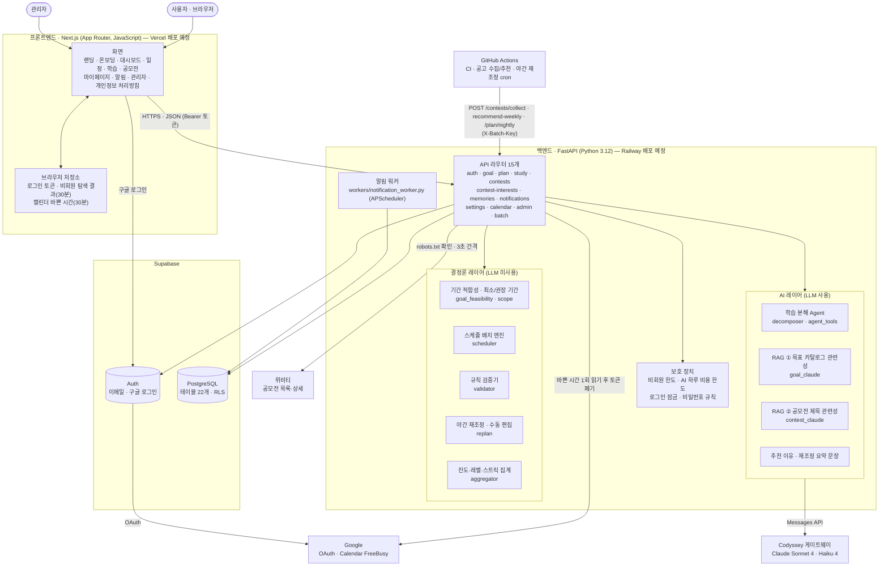
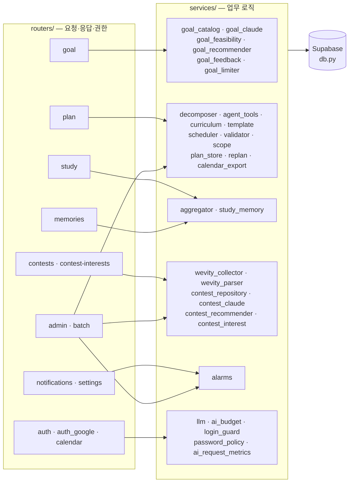
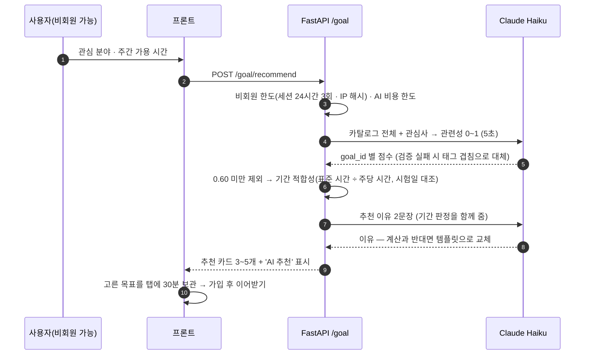
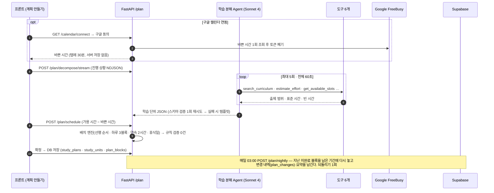
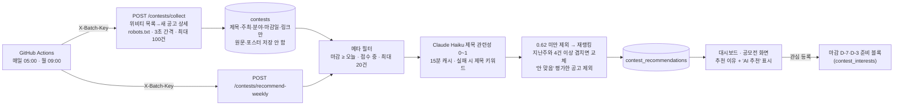
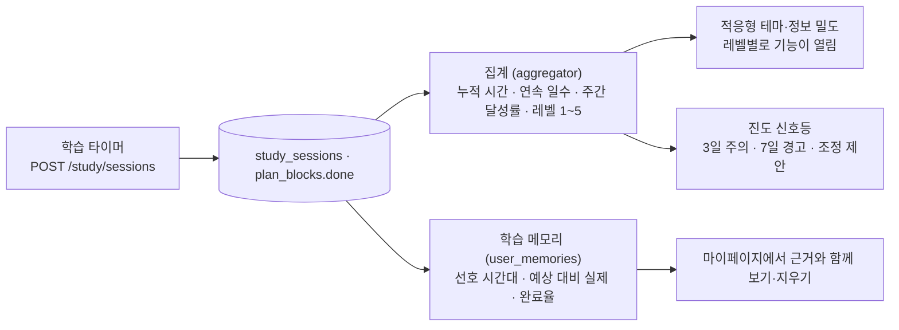
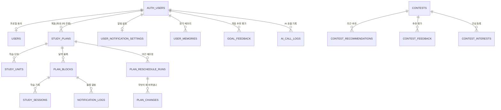
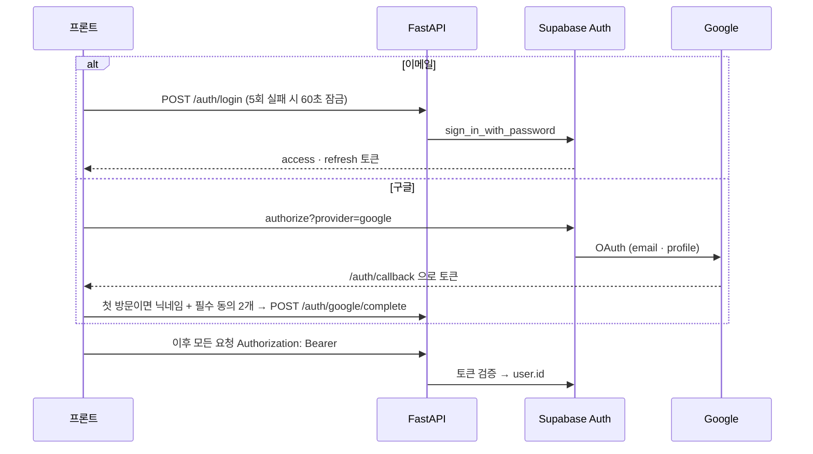
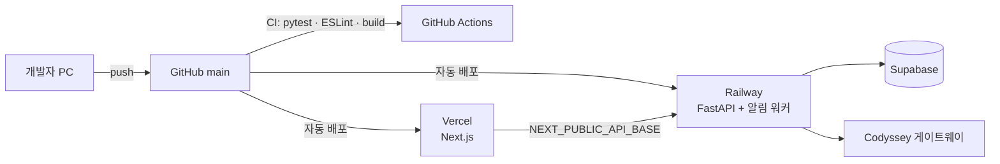

# 시스템 아키텍처 — 스터디페이스 (StudyPace)

> 기준: 2026-10-02 `main` 코드. 기획서 5-1절의 개념도를 실제 구현에 맞춰 풀어 쓴 문서다.
> 그림은 GitHub 에서 바로 보이는 Mermaid 로 그렸다. 구현이 바뀌면 이 문서도 함께 고친다.

## 1. 한눈에 보기

| 구성 요소 | 기술 | 하는 일 |
|---|---|---|
| 프론트엔드 | Next.js (App Router) · JavaScript | 화면 18개. API 호출은 `frontend/lib/api.js` 한 곳에서만 한다 |
| 백엔드 | FastAPI · Pydantic | 요청 검증, AI 호출, 일정 계산, DB 저장. 라우터 15개 (`backend/routers/`) |
| DB · 인증 | Supabase (PostgreSQL + Auth) | 회원·계획·학습 기록·메모리·알림·공고. 백엔드만 서비스 키로 쓴다 |
| LLM | Codyssey 게이트웨이 → Claude | Sonnet 4: 학습 분해 Agent / Haiku 4: 관련성 판단·추천 이유·요약 |
| 외부 연동 | Google OAuth · Calendar · 위비티 | 구글 로그인, 바쁜 시간 읽기, 공모전 수집 |
| 자동화 | GitHub Actions cron · 알림 워커 · 배치 API | 공고 수집·주간 추천·야간 재조정은 GitHub Actions, 분 단위 알림 6종은 워커 (§5) |

## 2. 설계 원칙 — LLM 을 쓰는 곳과 쓰지 않는 곳을 가른다

| 구간 | 방식 | 이유 |
|---|---|---|
| 판정 · 계산 (기간 적합성, 스케줄 배치, 진도 기준선, 규칙 검증) | **LLM 미사용** | 같은 입력이면 같은 결과가 나와야 검증할 수 있다. 마감 초과·선후 위반 0건을 코드로 보장한다 |
| 분해 · 언어화 (학습 분해, 관련성 판단, 추천 이유, 재조정 요약) | **LLM 사용** | 규칙으로 열거할 수 없는 영역 |

모든 AI 호출에는 **대체 경로**가 있다. 키가 없거나, 시간이 넘거나, 응답 검증에 실패하거나, 하루 비용 한도를 넘으면
학습 분해는 표준 커리큘럼 템플릿, 관련성 판단은 태그·제목 키워드, 추천 이유는 템플릿 문장으로 대신한다.
그래서 **AI 가 멈춰도 일정은 항상 만들어진다.** Claude 클라이언트는 `backend/services/llm.py` 한 곳에서만 만든다.

## 3. 백엔드 내부 구조

- **schemas/** — 요청·응답과 도메인 모델(Pydantic). 학습 분해 결과는 고정 JSON 스키마로 검증한다
- **migrations/** — 공용 DB 스키마 000~019. 적용 이력은 Supabase → Database → Migrations
- **evals/** — AI 품질 평가 정답셋·측정 스크립트 (`python -m evals.run_eval`)
- **tests/** — `FakeSupabase` 로 실제 DB·Claude 없이 도는 테스트 약 500개 (CI 에서 실행)

## 4. 핵심 흐름 — 4개 파이프라인

### 파이프라인 0 · 목표 탐색 (RAG ① + 결정론 계산)

### 파이프라인 1 · 일정 생성과 재조정 (AI Agent + 규칙 엔진)

학습 분해 Agent 의 도구 6개: `get_goal_catalog` · `search_curriculum` · `estimate_effort` · `get_available_slots` · `search_contests` · `save_plan`
(되돌리기 어려운 `save_plan` 은 Agent 가 직접 실행하지 않고 사용자 확인을 받는다.)

### 파이프라인 2 · 공모전 수집과 추천 (RAG ② + 자동화)

### 파이프라인 3 · 학습 실행과 화면 적응 (자동화 + Memory)

## 5. 자동화 · 배치

사람이 부르지 않는 작업은 모두 **배치 API + X-Batch-Key(`BATCH_SECRET`)** 로 열려 있고, 실행 결과는 `batch_runs` 에 남는다.

| 작업 | 엔드포인트 | 주기 | 지금 부르는 것 |
|---|---|---|---|
| 공고 수집 | `POST /contests/collect` | 매일 05:00 | GitHub Actions `contest-jobs.yml` (저장소 변수로 켜고 끔) |
| 주간 공모전 추천 | `POST /contests/recommend-weekly` | 월 09:00 | GitHub Actions `contest-jobs.yml` |
| 야간 재조정 | `POST /plan/nightly` | 매일 03:00 | GitHub Actions `plan-jobs.yml` (배포 후 저장소 변수로 켬) |
| 알림 6종 | `POST /batch/alarm/{before-block · after-block · daily-nightly · weekly-summary · replan-result · contest-deadline}` | 1분 ~ 주 1회 | 알림 워커 `workers/notification_worker.py` (APScheduler, 한국 시각) |

알림은 앱 안 알림(`notification_logs`)으로 쌓이고, 사이트를 열어 둔 브라우저는 허락을 받으면 브라우저 알림으로도 띄운다.
방해금지(기본 23~07시), 알림 강도, 선택 알림 3종, 독촉 하루 3회 같은 규칙은 `services/alarms.py` 가 보낼 때마다 확인한다.

## 6. 데이터 모델

| 묶음 | 테이블 | 비고 |
|---|---|---|
| 회원 | `users` · `private.withdrawn_profiles` | 동의 여부·AI 고지 버전. 탈퇴하면 서비스 데이터는 즉시 삭제, 프로필은 1년 보관 후 삭제 |
| 계획 | `study_plans` · `study_units` · `plan_blocks` | 단위와 블록을 나눠 긴 단위도 빈 시간에 맞춰 여러 블록으로 놓는다 |
| 재조정 | `plan_reschedule_runs` · `plan_changes` | 7일 보관, 되돌리기 1회 |
| 학습 | `study_sessions` | 5분 미만은 기록하지 않음 |
| 메모리 | `user_memories` · `goal_feedback` · `contest_feedback` | 근거·갱신 시점과 함께 저장, 사용자가 항목별·전체 삭제 |
| 공모전 | `contests` · `contest_recommendations` · `contest_interests` · `preparation_time_standards` | 원문·포스터는 저장하지 않는다 |
| 알림 | `notification_logs` · `user_notification_settings` | 같은 블록·같은 종류는 고유 인덱스로 한 번만 |
| 운영 | `ai_call_logs` · `ai_request_logs` · `batch_runs` · `curriculum_units` | AI 호출에는 프롬프트·답변 본문을 남기지 않는다 |

모든 테이블에 RLS 를 켜서 브라우저(익명 키)는 **본인 행만 읽기**가 가능하다. 쓰기는 백엔드(서비스 키)만 하며,
서비스 키는 RLS 를 통과하므로 백엔드 코드가 모든 조회에 본인 조건(`user_id`)을 건다.

## 7. 인증 · 보안 · 개인정보

| 위협·요구 | 대응 |
|---|---|
| 계정 탈취 | 로그인 5회 실패 60초 잠금 · 실패 문구 통일 · 흔한 비밀번호 1만 개·이메일/닉네임 포함 거부 · 재설정 시 전체 로그아웃 |
| 남용·비용 | 비회원 AI 24시간 3회(세션) + IP 해시 15회 · AI 하루 비용 한도(80% 비회원 차단, 100% 전체 차단 후 규칙으로 대체) · 에이전트 도구 5회 상한 |
| 개인정보 최소화 | 캘린더는 바쁜 시간대만 1회 읽고 토큰 폐기 · AI 에 이메일·닉네임을 보내지 않음 · IP 는 해시로만 |
| AI 윤리 | AI 결과에 'AI 추천' 표시와 부정확 가능 문구 상시 노출 · 가입 시 AI 고지 동의, 문구가 바뀌면 재동의 |
| 비밀값 | `.env` 는 깃 제외 · Claude 클라이언트는 `llm.py` 한 곳 · 비밀 키는 백엔드에만 |

## 8. 배포 구성

| 환경변수 | 어디에 | 용도 |
|---|---|---|
| `NEXT_PUBLIC_API_BASE` | Vercel | 백엔드 주소 |
| `SUPABASE_URL` · `SUPABASE_ANON_KEY` · `SUPABASE_SERVICE_ROLE_KEY` | Railway | DB · 인증 |
| `ANTHROPIC_API_KEY` · `ANTHROPIC_BASE_URL` | Railway | Codyssey 게이트웨이 |
| `FRONTEND_ORIGIN` · `PASSWORD_RESET_REDIRECT_URL` | Railway | CORS · 재설정 메일 링크 |
| `GOOGLE_CLIENT_ID` · `GOOGLE_CLIENT_SECRET` | Railway | 캘린더 바쁜 시간 (구글 로그인 키는 Supabase 대시보드) |
| `BATCH_SECRET` | Railway · GitHub Actions | 배치 API 보호 |
| `AI_DAILY_BUDGET_USD` · `IP_HASH_SALT` | Railway | 비용 한도 · IP 해시 |

배포 후 할 일: 구글 OAuth 클라이언트와 Supabase Redirect URLs 에 배포 주소 추가, GitHub 저장소 secrets(`STUDYPACE_API_BASE`·`BATCH_SECRET`)와 variables(`CONTEST_COLLECTION_ENABLED`·`CONTEST_RECOMMENDATIONS_ENABLED`·`NIGHTLY_REPLAN_ENABLED`) 설정, 알림 워커 실행, 테스트 계정 정리.
현재 로컬 실행은 [README 실행 방법](../README.md#실행-방법)을 따른다.

## 9. 관련 문서

| 문서 | 내용 |
|---|---|
| [기획서](../기획서_학습플래너.md) 5-1 · 5-4 | 개념 아키텍처 · 비기능 요구사항 |
| `기능명세서_학습플래너.xlsx` | 기능 69개 · AI 기능 명세 (Agent 도구, RAG 파라미터, 대체 정책) |
| [backend/README.md](../backend/README.md) | API · 학습 분해 Agent · 배치 엔진 · 알림 · 마이그레이션 |
| [frontend/README.md](../frontend/README.md) | 화면 구조 · 화면↔기능 ID |
| [AI 품질 평가 결과](../backend/evals/RESULTS.md) | 정답셋 측정 결과 |
